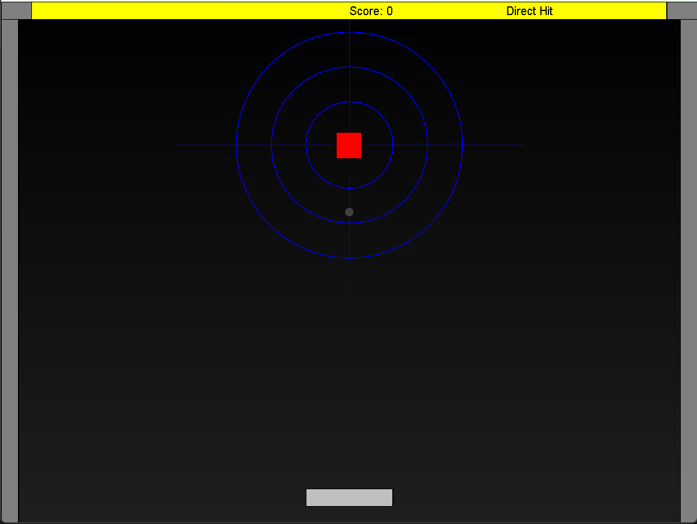

# Arkanoid 🎮

Welcome to **Arkanoid** — a classic brick-breaker game implemented in Java as part of an Object-Oriented Programming course.

> **Author**: Jonathan Tchebiner  
> **Course**: Object Oriented Programming (OOP)

---

## 🚀 How to Run

You can run the game in **two ways**:

### 1. Using Terminal (with Apache Ant)
    ant run

Make sure you have Apache Ant installed and that build.xml is present in the root directory.

2. Using the JAR file
Simply double-click the Arkanoid.jar file.

🧩 Features
🧱 Multiple Levels
Each level introduces unique block layouts and challenges:
Use the arrows to navigate the paddle!

Level 1

Level 2

Level 3

⏸️ Pause Functionality
Press P to pause the game and SPACE to resume.

🛠️ Technologies Used
Java

biuoop – GUI and animation library

Apache Ant – Build and run system

Object-oriented design principles

Enjoy the game and happy brick-breaking! 🧱🕹️